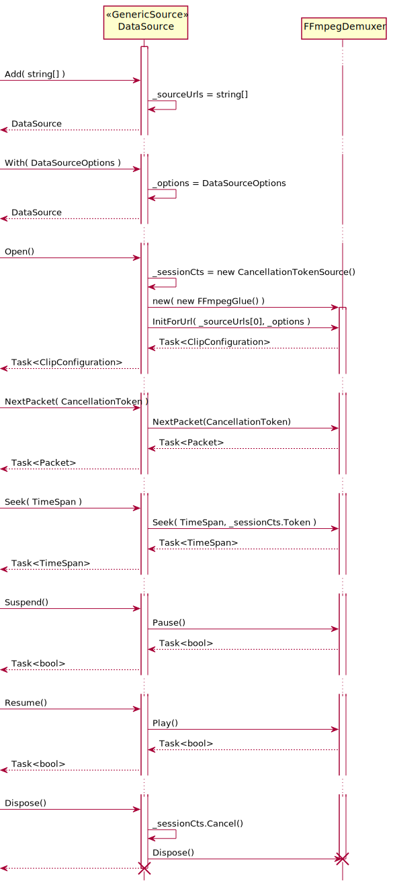
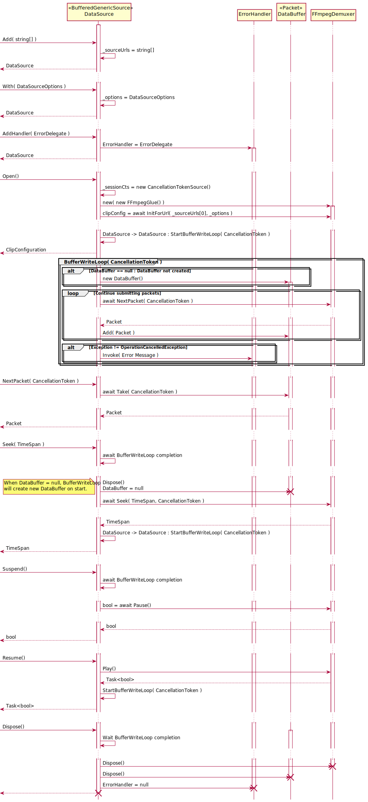

Data Source
===

Data Source represents a logical grouping of media tracts such as audio/video/data.
FFmpegPlayer provides two implementations

- GenericSource
- BufferedGenericSource

Implementations are interchangeable allowing for a choice where received data is to be buffered.
FFmpegPlayer and/or FFmpeg Library itself.

---
## GenericSource

---
## BufferedGenericSource

